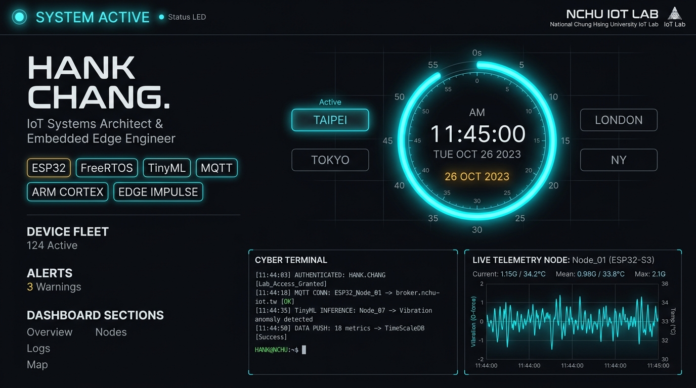
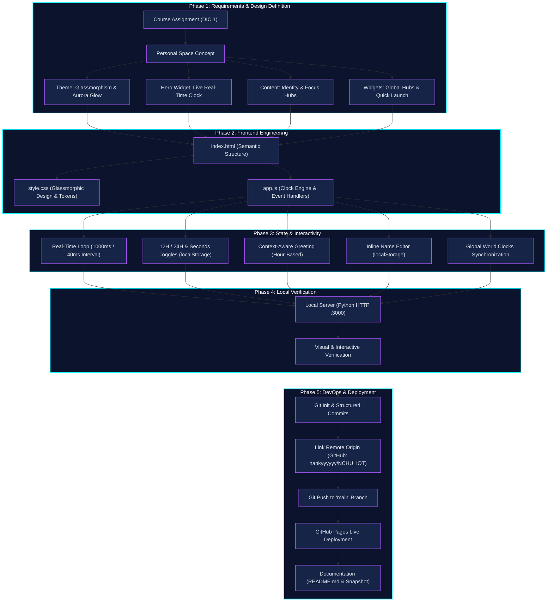

# NCHU AIoT 2026: Interactive Personal Dashboard & Real-Time Telemetry Interface
> **Assignment**: DIC 1 (Do In Class 1) — Personal Page & Live Time System  
> **Author**: Hank Chang  
> **Course**: Artificial Intelligence of Things (NCHU AIoT 2026)  
> **Repository**: [https://github.com/hankyyyyyy/NCHU_IOT](https://github.com/hankyyyyyy/NCHU_IOT)

---

## 🔗 Live Demonstration

👉 **Live Demo**: [https://hankyyyyyy.github.io/NCHU_IOT/](https://hankyyyyyy.github.io/NCHU_IOT/)



---

## 📖 Project Overview & Objectives

This project is a modern, high-performance personal dashboard created for **DIC 1 (Do In Class 1)** at National Chung Hsing University (NCHU). It bridges real-time temporal telemetry with front-end interactive design, reflecting the identity and focus areas of an AIoT engineer.

### Key Objectives:
1. **Dynamic Identity**: Display author name (**Hank Chang**) with inline customization backed by browser `localStorage`.
2. **Real-Time Clock Telemetry**: Implement a live precision digital clock with 12H/24H toggling, seconds switch, optional millisecond ticker, full calendar date, timezone detection, and day progress tracking.
3. **Context-Aware Experience**: Adapt page greetings dynamically based on the visitor's local hour (`Good morning`, `Good afternoon`, `Good evening`, `Good night`).
4. **Rich Glassmorphism Aesthetics**: Apply frosted glassmorphism (`backdrop-filter: blur`), glowing ambient aura, and responsive layout.
5. **Interactive Productivity Hub**: Include a Daily Focus mode switcher, Global Hubs world clocks (Tokyo, London, New York, San Francisco), and Quick Launch developer shortcuts.
6. **DevOps & Cloud Hosting**: Maintain disciplined Git version control and deploy continuously on GitHub Pages.

---

## 🚀 Core Features

- ⏱️ **Real-Time Telemetry Hero Clock**: High-precision clock updating hours, minutes, and seconds continuously with smooth digital boxes.
- 🌌 **Interactive HTML5 Canvas Particle Network**: Dynamic particle mesh reacting to cursor proximity with connecting node physics.
- 👤 **Identity Profile Card**: Author avatar with **HC** initials, active status badge, and AIoT specialization tags.
- 📋 **Copy Timestamp Tool**: One-click export of ISO 8601 and local timestamps to clipboard with animated floating toast notification.
- 🔄 **12H / 24H Format Switcher**: Instant toggle between 12-hour AM/PM and 24-hour format, remembered in `localStorage`.
- 🌅 **Dynamic Greeting Engine**: Context-aware greetings that adapt to the hour of day (`Good morning`, `Good afternoon`, `Good evening`, `Night mode active`).
- 📈 **Day Progress Bar**: Visual progress indicator tracking the exact percentage of the current day completed.
- 🧠 **AIoT 2026 Research Pillars**: Dedicated focus cards for Embedded Edge ML (TinyML), Sensor Networks, and Intelligent Automation.
- 🛠️ **Technical Arsenal Tags**: Interactive skill badges for C/C++, Python, ESP32, FreeRTOS, TinyML, MQTT, Linux, and Computer Vision.
- 📡 **Live Node Diagnostics Simulator**: Simulated gateway latency (14ms live fluctuating), CPU clock (240MHz), memory buffer, and animated sparkline wave.
- 🌐 **Global Hubs Synchronization**: World clocks displaying synchronized real-time hours across Tokyo, London, New York, and San Francisco.
- 🚀 **Quick Launch Shortcuts**: Fast direct links to GitHub repository (`NCHU_IOT`), profile, and developer portals.
- ✏️ **Profile Customizer Modal**: In-browser modal to customize display name and role with persistent state.

---

## 🛠️ Technology Stack

| Layer | Technology | Description & Usage |
| :--- | :--- | :--- |
| **Structure** | HTML5 Semantic Elements | Accessible document layout (`<header>`, `<main>`, `<section>`, `<footer>`) |
| **Styling** | Vanilla CSS3 | Cyberpunk glassmorphism, responsive grid & flexbox, keyframe ambient aura animations |
| **Typography** | Google Fonts | `Outfit` (clock/headings), `Inter` (body copy), `JetBrains Mono` (badges/code) |
| **Logic** | Vanilla JavaScript (ES6+) | Real-time interval clock, timezone resolution, format toggles, `localStorage` persistence |
| **Hosting & CI/CD** | GitHub Pages & Git | Source version control and static cloud hosting |

---

## 📊 Project Workflow



### Phase Breakdown:
1. **Requirements & Alignment**: Clarified personal branding (**Hank Chang**), glassmorphic aesthetic, and dynamic timekeeping goals for NCHU AIoT 2026.
2. **Frontend Construction**: Built semantic `index.html`, responsive glassmorphism styles in `style.css`, and modular JS in `app.js`.
3. **State Management**: Integrated `localStorage` to save user preferences, clock format, and display name.
4. **Local Verification**: Tested responsiveness, theme switching, and real-time clock loops via a local development server.
5. **Cloud Deployment**: Pushed code to GitHub repository and enabled GitHub Pages for global access.

---

## 📦 How to Run Locally

1. **Clone the repository**:
   ```bash
   git clone https://github.com/hankyyyyyy/NCHU_IOT.git
   cd NCHU_IOT
   ```

2. **Open directly**:
   - Double-click `index.html` to open in any web browser.

3. **Or serve via Python**:
   ```bash
   python -m http.server 3000
   ```
   Navigate to [http://localhost:3000](http://localhost:3000) in your browser.

---

## 📂 Repository Structure

```
.
├── .gitignore          # Git exclusion rules
├── README.md           # Comprehensive project documentation & workflow
├── app.js              # Clock logic, greeting engine, world clocks & widgets
├── demo_preview.png    # Live preview snapshot of the web application
├── index.html          # Semantic HTML5 layout and widget structures
└── style.css           # Glassmorphic styling, design tokens, and animations
```

---

© 2026 **Hank Chang** • NCHU AIoT Laboratory
