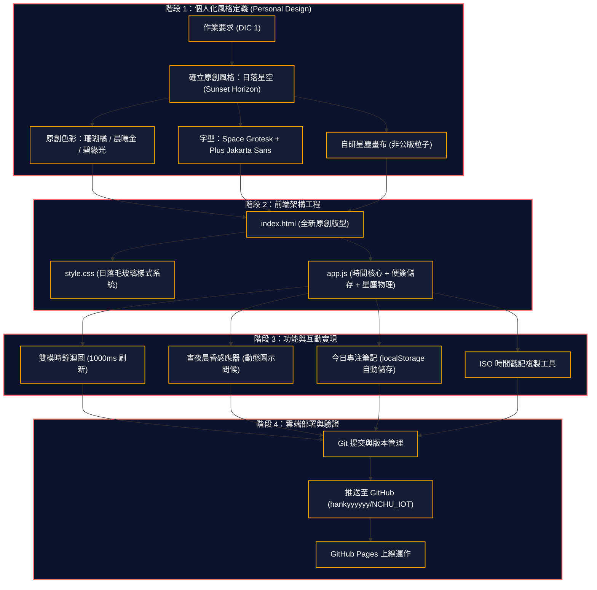

# Hank Chang | Personal Horizon & IoT Space
> **Assignment**: DIC 1 (Do In Class 1) — Personal Page & Live Time System  
> **Author**: Hank Chang  
> **Course**: 國立中興大學 物聯網實務 (NCHU IoT 2026)  
> **Repository**: [https://github.com/hankyyyyyy/NCHU_IOT](https://github.com/hankyyyyyy/NCHU_IOT)

---

## 🔗 Live Demonstration

👉 **線上即時展示 (Live Demo)**: [https://hankyyyyyy.github.io/NCHU_IOT/](https://hankyyyyyy.github.io/NCHU_IOT/)


---

## 🎨 原創個人化設計理念 (Personal Design Philosophy)

本專案完全遵循作業規範 **「不直接複製老師範本，打造專屬個人風格」**，從零重新架構色彩學、排版版型、動態物理與互動元件：

1. **原創色盤（Sunset Horizon Palette）**：
   - 拋棄公版的藍紫霓虹，改採**深黑藍夜幕（`#070a14`）**、**暮色珊瑚橘（`#ff6b6b`）**、**晨曦金橙（`#ffa502`）** 與 **極光碧綠（`#2ed573`）**，營造具備溫度與探索感的高質感風格。
2. **前衛字型體系（Typography）**：
   - 標題與巨型時鐘：採用現代幾何張力的 **`Space Grotesk`**。
   - 內文與資訊：採用高閱讀清晰度的 **`Plus Jakarta Sans`**。
   - 數值與標籤：採用技術質感等寬字 **`JetBrains Mono`**。
3. **原創動態背景（Cosmic Nebula Starfield）**：
   - 自主開發 HTML5 Canvas 星塵物理畫布，星光微微浮動，並具備**滑鼠引力互動效果**（粒子受游標引力吸引並繪製動態微光連線）。
4. **雙模時間核心站（Dual-Mode Time Station）**：
   - 巨型時、分、秒卡片式數字展示，支援 12H / 24H 模式切換。
   - **晝夜晨昏動態感應（Solar Greeting Engine）**：根據訪問當下的真實時間，自動判斷晨曦（🌅）、上午（🌤️）、正午（☀️）、午後（⛅）、黃昏（🌇）、深夜（🌙）並切換個人化問候語。
   - **當日時光流逝條**：即時計算當日秒數流逝百分比。
5. **特色原創功能卡片（Custom Interactive Cards）**：
   - **IoT 專案與感測器領域**：展示 ESP32 傳感遙測、MQTT 資料通道與邊緣 TinyML 部署重點。
   - **Hank 的今日專注筆記（Interactive Memo Pad）**：可直接在網頁即時輸入筆記，自動持久化儲存於瀏覽器 `localStorage`。
   - **全球樞紐時區同步**：同步換算東京、倫敦、紐約、舊金山時間。
   - **快速傳送門**：一鍵前往 GitHub 倉庫、中興大學首頁與常用工具。
   - **個人資料彈窗自訂**：隨時點擊「個人設定」即時客製姓名與自介。

---

## 🛠️ 技術架構 (Technology Stack)

| 層級 | 採用技術 | 說明與用途 |
| :--- | :--- | :--- |
| **結構** | HTML5 語意化標籤 | `<header>`, `<main>`, `<section>`, `<article>`, `<canvas>`, `<footer>` 完整語意架構 |
| **樣式** | 原生 Vanilla CSS3 | 日落星空配色系統、極限毛玻璃（Backdrop Filter Blur）、自適應響應式佈局 |
| **字型** | Google Fonts | `Space Grotesk` (時鐘/標題), `Plus Jakarta Sans` (內文), `JetBrains Mono` (標籤) |
| **邏輯** | 原生 Vanilla JavaScript (ES6+) | 星塵物理模擬、秒級時鐘迴圈、晝夜感測、本地 Memo 自動儲存、時區換算 |
| **部署** | GitHub Pages & Git | 自動化靜態託管與版本控制 |

---

## 📊 專案開發流程 (Workflow)



---

## 📦 如何在本地運行 (Local Run)

1. **複製本倉庫**：
   ```bash
   git clone https://github.com/hankyyyyyy/NCHU_IOT.git
   cd NCHU_IOT
   ```

2. **直接開啟**：
   - 使用任意瀏覽器雙擊 `index.html` 即可立即執行。

3. **或透過 Python 伺服器運行**：
   ```bash
   python -m http.server 3000
   ```
   在瀏覽器開啟 [http://localhost:3000](http://localhost:3000)。

---

## 📂 專案檔案結構 (Project Structure)

```
.
├── .gitignore          # Git 忽略檔案規則
├── README.md           # 專案詳細說明文件與設計理念
├── app.js              # 星塵物理畫布、時鐘核心、便簽存儲與全球時區
├── demo_preview.png    # 網頁即時展示截圖
├── index.html          # 原創 HTML5 語意化版面與各功能模組
└── style.css           # 日落星空配色、毛玻璃質感與自適應樣式
```

---

© 2026 **Hank Chang** • 國立中興大學 NCHU IoT 原創個人專屬設計
