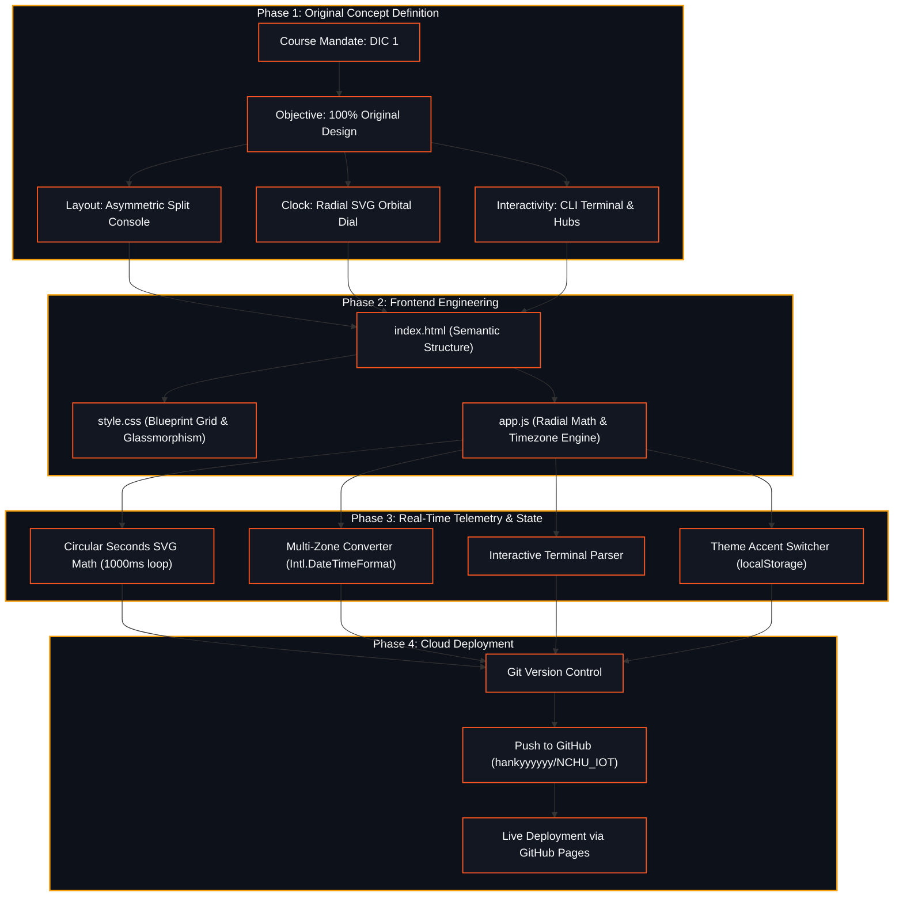

# Hank Chang | IoT Systems & Telemetry Console
> **Assignment**: DIC 1 (Do In Class 1) — Personal Page & Live Time System  
> **Author**: Hank Chang  
> **Institution**: National Chung Hsing University (NCHU IoT 2026)  
> **Repository**: [https://github.com/hankyyyyyy/NCHU_IOT](https://github.com/hankyyyyyy/NCHU_IOT)

---

## 🔗 Live Demonstration

👉 **Live Site**: [https://hankyyyyyy.github.io/NCHU_IOT/](https://hankyyyyyy.github.io/NCHU_IOT/)


---

## 🎨 Original Design Philosophy (DIC 1 Guidelines)

This project strictly adheres to the course assignment mandate: **"Do not directly copy the teacher's template; engineer your own distinctive personal style."**

Every visual layer, structural layout, animation, and interaction has been built from scratch to reflect an original **IoT Systems & Telemetry Console**:

### 1. Asymmetric Split-Console Layout
- Replaces the generic vertical card stack with an asymmetric dual-column console layout:
  - **Left Identity Column**: Massive modern typography (`HANK CHANG.`), researcher tagline, hardware competency badges, and quick actions.
  - **Right Telemetry Column**: Radial orbital time station with a sweeping SVG progress dial and multi-hub timezone switcher.

### 2. Radial Orbital SVG Clock Engine
- An original circular SVG ring dial dynamically calculating the exact second's progress via `stroke-dashoffset` interpolation.
- **Multi-Hub Timezone Switcher**: Clickable timezone buttons (`Taipei UTC+8`, `Tokyo +9`, `London +1`, `New York -4`, `San Francisco -7`) that immediately convert the main clock display and date to that locale.
- **Dynamic Daytime Indicator**: Context-aware greetings that adapt to morning, afternoon, evening, and night.
- Day progress meter tracking percentage of the day completed.

### 3. Interactive CLI Cyber Terminal
- An in-browser command-line interface with interactive prompt `hank@nchu:~$`.
- Supports built-in commands (`help`, `about`, `projects`, `time`, `contact`, `clear`) and one-click quick action chips.

### 4. Real-Time Hardware Telemetry Simulation
- Live telemetry stats monitoring simulated ESP32 gateway ping latency with dynamic jitter, MCU clock frequency, and memory buffer.
- Keyframe animated continuous signal continuity waveform.

### 5. Dynamic Theme Accent Engine
- On-the-fly theme switcher allowing visitors to toggle between **Amber Horizon** (`#f59e0b`), **Cyber Emerald** (`#10b981`), and **Electric Cyan** (`#00f2fe`) with persistent state.

### 6. Auto-Saving Research Notes Pad
- Integrated quick notes memo area that saves input automatically to browser `localStorage` with real-time feedback.

---

## 🛠️ Technology Stack

| Layer | Technology | Usage & Implementation |
| :--- | :--- | :--- |
| **Structure** | Semantic HTML5 | Clean accessible markup with unique element IDs and responsive containers |
| **Styling** | Vanilla CSS3 | Custom blueprint grid overlay, CSS custom properties, theme accents, glass panels |
| **Typography** | Google Fonts | `Space Grotesk` (headings/numbers), `Plus Jakarta Sans` (body), `JetBrains Mono` (telemetry/CLI) |
| **Logic** | Vanilla JavaScript (ES6+) | SVG radial calculation, timezone conversion, CLI command parser, autosave engine |
| **Deployment** | GitHub Pages & Git | Static cloud hosting and automated continuous deployment |

---

## 📊 Project Architecture & Workflow



---

## 📦 How to Run Locally

1. **Clone the repository**:
   ```bash
   git clone https://github.com/hankyyyyyy/NCHU_IOT.git
   cd NCHU_IOT
   ```

2. **Open directly**:
   - Double-click `index.html` in any modern web browser.

3. **Or serve via Python**:
   ```bash
   python -m http.server 3000
   ```
   Navigate to [http://localhost:3000](http://localhost:3000).

---

## 📂 Project Structure

```
.
├── .gitignore          # Git exclusion rules
├── README.md           # Comprehensive project documentation & architecture
├── app.js              # Radial SVG dial, timezone switcher, CLI terminal & state
├── demo_preview.png    # Live preview screenshot
├── index.html          # Semantic HTML5 asymmetric console structure
└── style.css           # Blueprint grid, theme accents, and responsive layout
```

---

© 2026 **Hank Chang** • National Chung Hsing University (NCHU IoT)
